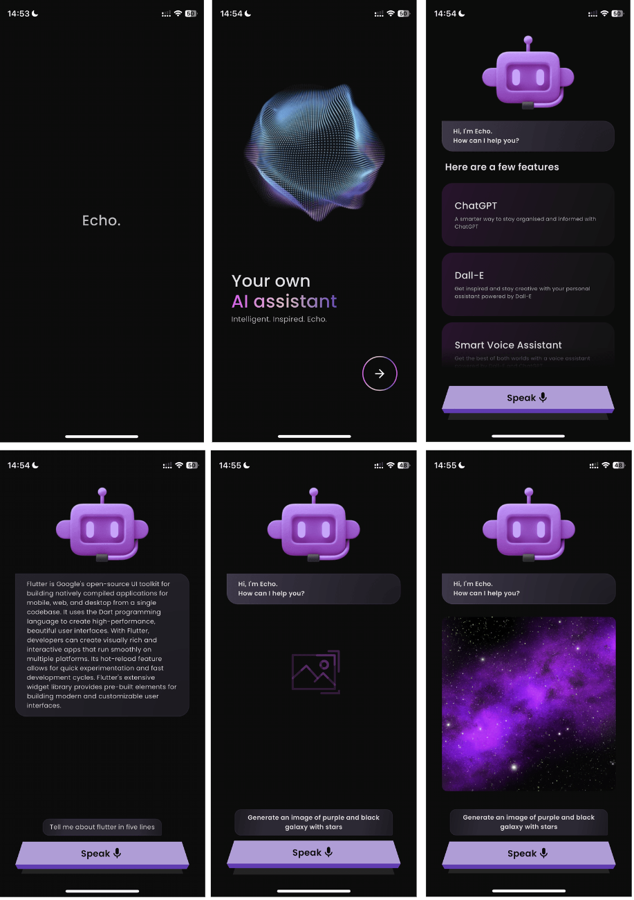

<a href="https://flutter.dev/">
  <h1 align="center">
    <picture>
      
    </picture>
  </h1>
</a>

# Echo - AI-Powered Text and Image Generation App.

Echo is an AI-powered assistant that transforms spoken words into intelligent text and captivating images. Powered by chatGPT and dallE, it amplifies your voice and brings your ideas to life like never before. Simply speak, and Echo will create compelling content based on your input.

## Demo



## Technical Details

- **Framework:** Echo is built with Flutter, a cross-platform framework that enables seamless compatibility and a consistent user experience across different devices and operating systems.

- **User Experience (UX):** The app prioritizes user experience by incorporating haptic feedback and smooth animations, creating an interactive and delightful user interface.

- **Modern UI:** Echo follows a modern design language, featuring a clean and intuitive user interface (UI) that enhances usability and provides a visually appealing experience.

- **Cross-Platform Integration:** Echo seamlessly integrates with various platforms and applications, allowing for flexible integration into existing workflows or expansion of its functionalities.

## Installation

To get started with Echo, follow these steps:

1. Clone the repository:

   ```bash
   git clone https://github.com/rupnkrdas/echo.git
   ```

2. Create an API Keys file:

   Inside the `lib/constants` directory, create a new file named `config.dart`. This file will contain your OpenAI API key.

   ```dart
   // lib/constants/config.dart

   const openAIAPIKey = '$YOUR_API_KEY';
   ```

   Replace `$YOUR_API_KEY` with your actual OpenAI API key.

3. Install the required dependencies:

   ```bash
   flutter pub get
   ```

4. Launch the Echo app:

   ```bash
   flutter run
   ```

5. Access Echo through your device or emulator.

**Ensure you have Flutter installed and properly set up before proceeding with the installation steps.**

**Note:** Make sure to keep the API keys file confidential and do not expose your API key publicly.

Now you're ready to use Echo and generate intelligent text and captivating images based on your input. Enjoy the app and unleash your creativity!

## Usage

To use Echo app, follow these steps:

- Launch the Echo app on your device or emulator.
- Speak your thoughts or input using the app's voice recognition feature.

- Watch as Echo transforms your spoken words into intelligent text and generates captivating images based on your input.

## API Reference

The Echo app utilizes the following APIs for its intelligent text generation and image creation:

- [GPT API](https://platform.openai.com/docs/guides/gpt/gpt-models): The Echo app utilizes the chatGPT API by OpenAI to generate intelligent and coherent text based on user input.

- [Image generation API](https://platform.openai.com/docs/guides/images/image-generation): The Echo app employs the dallE API by OpenAI to produce captivating images based on user input.

Please refer to the respective API documentation for detailed information on how to use these APIs in your own projects.

## Color Reference

-  `Purple Pizzazz: #E655EF`
-  `Cameo Pink: #E1BAC3`
-  `Plump Purple: #FF5252`
-  `Smoky Black: #0C0C0C`
-  `Platinum: #E1E1E5`

## Authors

- [@rupnkrdas](https://www.github.com/rupnkrdas)
